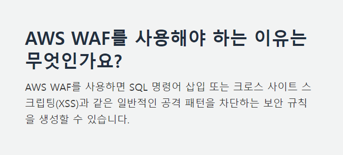

# Security-Automations-for-AWS-WAF-Summary

# AWS WAF 보안 자동화

## AWS WAF

1. AWS Web Application Firewall
2. 웹 어플리케이션 방화벽
3. Load Balancer / API Gateway 등등에 전달되는 HTTP 및 HTTPS 요청의 모니터링 및 콘텐츠에 대한 엑세스 제어 서비스 제공
4. 2019년 11월 AWS WAFv2출시




## AWS WAF 사용 예시

1. **웹 트래픽 필터링**
2. 봇 트래픽 제어
3. 로그인 페이지 무단 액세스 모니터링 및 보호
4. 가짜 계정 모니터링 및 보호
5. API를 통한 유지보수
6. **실시간 가시성**
7. **AWS Firewall Manager와 통합**

출처 : [AWS WAF 기능](https://aws.amazon.com/ko/waf/features/)

## AWS WAF 보안 자동화

1. AWS에서 일반적인 웹 기반 공격을 필터링하는 AWS WAF 규칙세트를 배포,
2. 기본적으로는 AWS 내부 IaC툴인 Cloud Formation 템플릿으로 제공하여 손쉽게 적용이 가능
3. 템플릿 일부분
    
    ```yaml
          ActivateAWSManagedSQLParam:
            default: Activate SQL Database Managed Rule Group Protection
    
          ActivateAWSManagedLinuxParam:
            default: Activate Linux Operating System Managed Rule Group Protection
    
          ActivateAWSManagedPOSIXParam:
            default: Activate POSIX Operating System Managed Rule Group Protection
    
          ActivateAWSManagedWindowsParam:
            default: Activate Windows Operating System Managed Rule Group Protection
    
          ActivateAWSManagedPHPParam:
            default: Activate PHP Application Managed Rule Group Protection
          
          ActivateAWSManagedWPParam:
            default: Activate WordPress Application Managed Rule Group Protection
    
          ActivateSqlInjectionProtectionParam:
            default: Activate SQL Injection Protection
    
          SqlInjectionProtectionSensitivityLevelParam:
            default: Sensitivity Level for SQL Injection Protection
    ```
    
    설명
    
    - **`ActivateAWSManagedSQLParam`**: AWS 관리형 SQL 데이터베이스 규칙 그룹 보호를 활성화합니다. 이 옵션은 SQL 데이터베이스에 대한 관리형 보호 규칙을 활성화합니다.
    - **`ActivateAWSManagedLinuxParam`**: AWS 관리형 리눅스 운영 체제 규칙 그룹 보호를 활성화합니다. 이 옵션은 리눅스 운영 체제에 대한 관리형 보호 규칙을 활성화합니다.
    - **`ActivateAWSManagedPOSIXParam`**: AWS 관리형 POSIX 운영 체제 규칙 그룹 보호를 활성화합니다. 이 옵션은 POSIX 운영 체제에 대한 관리형 보호 규칙을 활성화합니다.
    - **`ActivateAWSManagedWindowsParam`**: AWS 관리형 Windows 운영 체제 규칙 그룹 보호를 활성화합니다. 이 옵션은 Windows 운영 체제에 대한 관리형 보호 규칙을 활성화합니다.
    - **`ActivateAWSManagedPHPParam`**: AWS 관리형 PHP 애플리케이션 규칙 그룹 보호를 활성화합니다. 이 옵션은 PHP 애플리케이션에 대한 관리형 보호 규칙을 활성화합니다.
    - **`ActivateAWSManagedWPParam`**: AWS 관리형 WordPress 애플리케이션 규칙 그룹 보호를 활성화합니다. 이 옵션은 WordPress 애플리케이션에 대한 관리형 보호 규칙을 활성화합니다.
    - **`ActivateSqlInjectionProtectionParam`**: SQL Injection 보호를 활성화합니다. 이 옵션은 SQL Injection 공격을 탐지하고 차단하는 보호 기능을 활성화합니다.
    - **`SqlInjectionProtectionSensitivityLevelParam`**: SQL Injection 보호의 민감도 수준을 설정합니다. 이 옵션은 SQL Injection 공격에 대한 감지의 엄격성 수준을 조절합니다.
    
    소스코드
    
    https://github.com/aws-solutions/aws-waf-security-automations.git
    
    ### 비용
    
    해당 AWS WAF 자동화 솔루션을 사용할 시 비용
    
    버지니아 북부(us-east-1)기준 월 **$547.33(한화 763,914원)**
    
    ### 비용 명세
    
    | AWS 서비스 | 치수 | 비용 [$ USD]/월 |
    | --- | --- | --- |
    | 아마존 API 게이트웨이 | 매월 1,000,000건의 REST API 호출 | $3.50 |
    | 아마존 코그니토 | 고급 보안 기능 없이 매월 활성 사용자 1,000명 | $0.00 |
    | 아마존 S3 | 100GB 데이터 전송 + 1,000,000개 요청 — Kinesis의 레코드 100개 x 100KB | $3.27 |
    | AWS 람다 | 200ms 기간의 요청 2,000,000개 | $1.23 |
    | 시스템 관리자 매개변수 저장소 | 10개의 표준 매개변수를 포함한 2,000,000개의 요청 | $0.00 |
    | 아마존 렉스 | 월별 문자 요청 100,000건 | $75.00 |
    | 아마존 데이터 파이어호스 | 레코드당 100KB로 월별 레코드 100,000개 | $0.28 |
    | 아마존 다이나모DB | 1GB 스토리지 + 초당 읽기 1회 및 쓰기 1회 + 매월 최대 읽기/쓰기 20시간 | $11.41 |
    | 아마존 폴리 | 요청 10,000개 + 요청당 문자 50자 | $4.00 |
    | 아마존 번역 | 요청 100,000개 + 요청당 50자(영어가 아닌 경우 선택 사항) | $75.00 |
    | 아마존 컴프리헨드 | 요청 100,000개 + 요청당 문자 50자 | $5.00 |
    | 아마존 오픈서치 서비스 | M6g.large4개 노드에 대해 한 달에 24시간 내내 실행되는 인스턴스 | $368.64 |
    |  | 총: | $547.33/월 |
    | 텍스트 임베딩을 위한 Amazon SageMaker 엔드포인트(선택 사항) | ml.m5.xlarge노드 1개에 대해 한 달 내내 모든 시간 실행되는 인스턴스 | $165.60 |
    |  | 총: | $712.93/월 |
    | LLM 질문 답변을 위한 Amazon SageMaker 엔드포인트(선택 사항) | ml.g5.12xlarge노드 1개에 대해 한 달 내내 모든 시간 실행되는 인스턴스 | $5,104.80 |
    |  | 총계: 임베딩 및 LLM 포함 | $5,817.73/월 |
    
    자동화는 아니지만 다른 IaC Tool인 Terraform을 이용한 AWS WAF 사용 템플릿
    
    [https://github.com/aws-samples/aws-waf-automation-terraform-samples.git](https://github.com/aws-samples/aws-waf-automation-terraform-samples.git)
    
    [https://www.lgcns.com/blog/cns-tech/aws-ambassador/41298/](https://www.lgcns.com/blog/cns-tech/aws-ambassador/41298/)